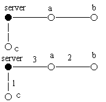

# hw2 
## task1
单调栈
### Description
N个人正在排队进入一个音乐会。人们等得很无聊，于是他们开始转来转去，想在队伍里寻找自己的熟人。队列中任意两个人A和B，如果他们是相邻或他们之间没有人比A或B高，那么他们是可以互相看得见的。

写一个程序计算出有多少对人可以互相看见。

输入的第一行包含一个整数N (1 ≤ N ≤ 500 000), 表示队伍中共有N个人。

接下来的N行中，每行包含一个整数，表示人的高度，以毫微米(等于10的-9次方米)为单位，每个人的调度都小于2^31毫微米。这些高度分别表示队伍中人的身高。

输出仅有一行，包含一个数S，表示队伍中共有S对人可以互相看见。

### Thoughts
这个题要求输出能互相看见的人的对数，普通DP的时间复杂度约为$O(N^2)$，因此对于500000的数据来说，需要用单调栈维护。

因为两人（设为A,B）之间不能有人高于二者任意一人的高度，因此一旦A后面有一个人C的身高大于A，则可判定A不能被C后面任意一个人看见。

如果这个题没有重复身高的话，这个题已经做完了当然这是不可能的。这个题会有重复身高，比如1 2 2 2 3中，不是每个2都能看到1，但是3可以看到每个2。对于这种情况，我们要特殊处理。

为保证栈内元素都是后来有可能被看到的（即没有被遮挡的），栈的单调性是非严格单调递减，相同元素同时存在。

1. 相邻的两个人一定能互相看见，所以如果进栈元素x小于等于栈顶元素，sum++。将元素进栈。
2. 如果x大于栈顶元素，则栈内小于x的元素都可以被x看见，等于x的元素也可以被看见，但是数据要被保留，不出栈。每出栈一个数，将sum++。注意，当满足“小于x”的元素全部出栈后，栈顶如果有元素，那么它也可以被x看见，sum还是要++。回到1。
3. 对于2中提到的“栈顶元素”，如果与x相等，就可以看见栈内所有与x相等的数（一串数）。并且这串数前面的一个元素也可以被x看见（例如3 2 2 2中，新进入一个2，那么它可以看见这一串2以及它们前面的3）。当栈内全部是同一数字时，没有这串数前面的一个元素了，就不用sum++，代码中注释的地方就是这里的体现。

注意，无论何时，如果栈是空的，sum是不用+1的。

因为$500000\times 500000=250000000000>2^{31}-1$,所以需要开longlong。

## task2

### 题目描述

树型网络是最节省材料的网络。所谓树型网络，是指一个无环的连通网络，网络中任意两个结点间有且仅有一条通信道路。

网络中有一个结点是服务器，负责将信号直接或间接地发送到各终端机。如图上方，server结点发出一个信号给结点a和c，a再转发给b。如此，整个网络都收到这个信号了。

但是，实际操作中，信号从一个结点发到另一个结点，会出现信号强度的衰减。衰减量一般由线路长度决定。

如图下方，边上所标的数字为边的衰减量。假设从server出发一个强度为4个单位的信号，发到结点a后强度衰减为4-3=1个单位。结点a再将其转发给结点b。由于信号强度为1，衰减量为2，因此信号无法发送到b。

一个解决这一问题的方法是，安装信号放大器。信号放大器的作用是将强度大于零的信号还原成初始强度（从服务器出发时的强度）。

上图中，若在结点a处安装一个信号放大器，则强度为4的信号发到a处，即被放大至4。这样，信号就可以被发送的网络中的任意一个节点了。为了简化问题，我们假定每个结点只处理一次信号，当它第二次收到某个信号时，就忽略此信号。

你的任务是根据给出的树型网络，计算出最少需要安装的信号放大器数量。

### 输入格式

第一行一个整数n，表示网络中结点的数量。（n<=20000）

第2~n+1行，每行描述一个节点的连接关系。其中第i+1行，描述的是结点i的连接关系：首先一个整数k，表示与结点i相连的结点的数量。此后2k个数，每两个描述一个与结点i相连的结点，分别表示结点的编号（编号在1~n之间）和该结点与结点i之间的边的信号衰减量。结点1表示服务器。

最后一行，一个整数，表示从服务器上出发信号的强度。

### 输出格式

一个整数，表示要使信号能够传遍整个网络，需要安装的最少的信号放大器数量。

如果不论如何安装信号放大器，都无法使信号传遍整个网络，则输出“No solution.”

#### 树形DP

考虑树的一条枝干的任意子段，出现以下 33 三种情况是允许的：

建 --- 建

建 --- 不建 --- 建

建 --- 不建 --- 不建 --- 建

竖着看，对于一个节点，最远不建站的节点是自己的儿子的儿子，这时候，自己必须要建站，不然儿子将没有信号。

那么对于节点我们就可以设三种状态，分别是：

$f[i][0]f[i][0]$ 自己建站

$f[i][1]f[i][1]$ 自己不建，儿子至少有一个建站（这种状态的意义是 可以不需要父亲建站，因为自己的儿子已经给了自己信号）

$f[i][2]f[i][2]$ 自己不建，儿子也不建（这种状态要求儿子必须要已经有信号，父亲必须要建站）

现在来分条考虑转移：

1. 自己建站：
自己动手，丰衣足食，可以由儿子的所有状态转移而来
$f[i][0]=\sum_{i->j}\min(f[j][0],f[j][1],f[j][2])$
$f[i][0]= i−>j∑min(f[j][0],f[j][1],f[j][2])$
2. 自己不建，儿子至少有一个建站（最烦人的状态）:
首先这个状态肯定不能由儿子的 33 状态转移而来（想想为什么）。因为可多个儿子建站，我们先不管是否存在至少一个儿子最优状态是 11 状态（建站状态），每次贪心取儿子 1,21,2 状态最小的代价转移，同时记录儿子从 22 状态改取为 11 状态的最小花费，如果最后最小花费为负，说明存在至少一个儿子最优状态是 11 状态，贪心正确，不需要改取。否则说明所有儿子的最优状态都是 22 状态，将这个最小改取费用加上即可。
$f[i][1]=(i−>j∑ min(f[j][0],f[j][1]))+max(0,min(f[j][0]−f[j][1]))$
3. 自己不建，儿子也不建：
因为自己不建，还要求儿子不能建，所以儿子要有信号来源必须要向它自己的儿子要，所以此状态只能从儿子的 22 状态转移而来。

边界条件 -> 对于叶子节点：
$f[i][0]=1,f[i][1]=INF,f[i][2]=0f[i][0]=1,f[i][1]=INF,f[i][2]=0 $。 （显然）

最后，根节点没有父亲，它不能吃父亲的本，就只能自己建或者靠儿子的信号度日。

最后的优化函数 $f[x][sum]=min(∑f[v][sum-l],∑f[v][res-l]+1) $

设g[i]表示以i为根的子树所需的最小信号强度，f[i]表示以i为根的子树所需的最少信号放大器数。

那么接下来分情况讨论一下。

- 若i是叶子节点，则g[i]=1,f[i]=0。
- 若i不是叶子节点，则g[i]=max(g[Soni]+dis[i][Soni]),f[i]=sum(f[Soni])。
- 若`i!=0 && 初始信号-dis[Father_of_i][i]，则需要新建一个信号放大器，即f[i]++,g[i]=1。

然后直接DP就好了。

注意输入是有向图。

#### 树上贪心

由树形DP可知树上贪心是最优解

树形DP。

设g[i]表示以i为根的子树所需的最小信号强度，f[i]示以i为根的子树所需的最少信号放大器数。

那么接下来分情况讨论一下。

- 若i是叶子节点，则g[i]=1,f[i]=0。
- 若i不是叶子节点，则g[i]=max(g[Son_of_i]+dis[i][Son_of_i]),f[i]=sum(f[Sin_of_i])。
- 若i!=0 && 初始信号-dis[Father_of_i][i]<g[i]，则需要新建一个信号放大器，即f[i]++,g[i]=1。

然后直接DP就好了。

注意输入是有向图。

比较精简的代码[见蒟蒻的blog](http://m-sea-blog.com/index.php/archives/253/)

#### 后序遍历
dfs遍历返回以当前点为根所需的最大信号强度

若当前点与其父节点相连所需的信号强度+dfs(当前点)>能提供的最大信号强度，则ans++(不得不加)

## task3
### 主要思路
邻接矩阵存数据,linked list递归.注意bottom up.