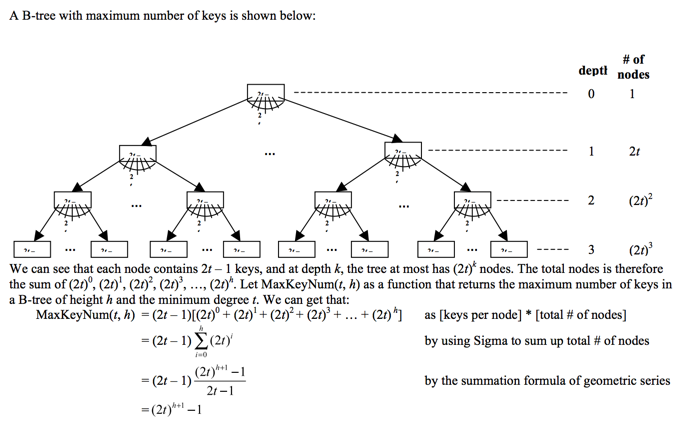

### Exercises 18.1-1
***
Why don't we allow a minimum degree of t = 1?

### `Answer`
According to the definition, minimum degree t means every node other than the root must have at least t – 1 keys, and every internal node other than the root thus has at least t children. So, when t = 1, it means every node other than the root must have
at least t – 1 = 0 key, and every internal node other than the root thus has at least t = 1 child.

Thus, we can see that the minimum case doesn't exist, because no node exists with 0 key, and no node exists with only 1 child
in a B-tree.

### Exercises 18.1-2
***
For what values of t is the tree of Figure 18.1 a legal B-tree?

### `Answer`
According to property 5 of B-tree, every node other than the root must have at least t−1keys and may contain at most 2t−1 keys. In Figure 18.1, the number of keys of each node (except the root) is either 2 or 3. So to make it a legal B-tree, we need
to guarantee that

t – 1 ≤ 2 and 2 t – 1 ≥ 3,

which yields 2 ≤ t ≤ 3. So t can be 2 or 3. 

### Exercises 18.1-3
***
Show all legal B-trees of minimum degree 2 that represent {1, 2, 3, 4, 5}

### `Answer`
The question asks for the legal trees with min degree t=2. So, each node can contain x num of keys while 1 ≤ x ≤ 3
```
     2
  1     3 4 5
```

```
         4
  1 2 3     5
```

```
        3
  1 2      4 5
```
			
```
    2 4
  1  3  5
```

```
    2 3 4
  1       5
```

### Exercises 18.1-4
***
As a function of the minimum degree t, what is the maximum number of keys that can be stored in a B-tree of height h?

### `Answer`


### Exercises 18.1-5
***
Describe the data structure that would result if each black node in a red-black tree were to absorb its red children, incorporating their children with its own.

### `Answer`
After absorbing each red node into its black parent, each black node may contain 1, 2 (1 red child), or 3 (2 red children) keys, and all leaves of the resulting tree have the same depth, according to property 5 of red-black tree (For each node, all paths
from the node to descendant leaves contain the same number of black nodes). Therefore, a red-black tree will become a Btree with minimum degree t = 2, i.e., a 2-3-4 tree.

***
Follow [@louis1992](https://github.com/gzc) on github to help finish this task.

