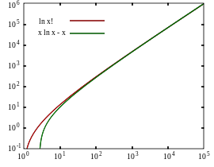

# stiring equation
stiting equation is a equation to get a N-factorial approximation



the equation:   

As the picture depicted，for a big enough int n，two int is similar in size. More percisely:   

或者

 We can deduct the equation not by directly evaluating $n!$, but by considering its natural log：

   

The time complexity of the  normal way to calculate $n! $ is O(N):   $N！= 1 * 2 * 3 * 4 * 5 * ............ * N$ 

if we just want to get the digit number. the time complexity is $lgN！+1$

which is: 

When n is big enough，the equation is true:

（e = 2.718）

Stirling formula can be used to estimate the size of a number, combined with LG can estimate the number of digits of a number, or can estimate the factorial of a number is a multiple of another number.

Example:  http://acm.hdu.edu.cn/showproblem.php?pid=1018
The range of N: $1<= N <= 10^7 $
It is certain that the number of digits after the factorial of N can not be calculated by ordinary method, but it can be solved well by using Stirling's formula.

```cpp
#include <bits/stdc++.h>
using namespace std;
 
int main ()
{
    int w;
    scanf("%d",&w);
    while(w--)
    {
        int z, i;
        double sum = 0;
        scanf("%d",&z);
        for(i = 1; i <= z; i++)
            sum += log10( double(i) );
        printf("%d\n",int(sum) + 1);
    }
    return 0;
}

```